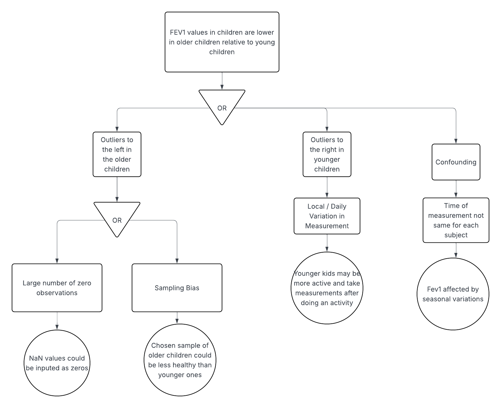

## Name

Dylan Huynh - dth2238

### Setup

Read in the data with `read_csv()` and store the data as an R object named `dataset`. Check the data to make sure all of the expected observations and variables are there.


```{r}
library(tidyverse)
library(dplyr)

## Load the data and any necessary packages here.
dataset <- read.csv("./maacs.csv.gz")
head(dataset)
```

## Part 1

We will first consider the relationship between FEV1 and age. In general, it is expected that as children get older (and hence, larger in size), their FEV1 values should get higher. 

Consider the statement "FEV1 values in children are higher in older children relative to younger children". 

Write a function in R that takes the `dataset` object as an argument and returns `TRUE` if the statement above is true for the dataset and `FALSE` otherwise. 

NOTE: In order to write this function, you will need to translate the statement above into something that can be checked with the data. There are many ways in which you can do that translation correctly and you only need to pick one way here. 

NOTE: For this part, do not use any plots.

```{r}

higher_check <- function(dataset) {
  data <- dataset %>% 
    select(age, fev1) %>% 
    drop_na()
  
  correlation <- cor(data$age, data$fev1)
  
  correlation > 0
}

higher_check(dataset)
```

To check the statement "FEV1 values in children are higher in older children relative to younger children", we 
would expect the correlation between the `age` and `fev1` columns to be positive. The function computes this
correlation, and returns true if it is positive. 

## Part 2

Fit a linear regression model with FEV1 as the outcome and age as a predictor.

How much does FEV1 change for a 1-year increase in the child's age? 

```{r}
model <- lm(fev1 ~ age, data=dataset)
summary(model)
```


Write your data analysis statement interpreting the regression model here:

Using our model, we can conclude that the expected difference in forced expiratory volume in 1 second between subjects whose age differs by one year is equal to 0.17 liters. This supports the claim that `fev1` values are higher in older children, as we expect a positive increasing relationshp between `age` and `fev1`. 

## Part 3

Develop **three** supporting premises derived from the data that support the statement you wrote in Part 2. These can be plots, other summary statistics, or model results. 

NOTE: 

* At least one supporting premise should use a plot.

* Do not use the code you write in Part 1 as a supporting premise

Write the three supporting premise statements here:

1. The plot of `age` vs `fev1` value appears to be increasing with age. 

2. After fitting a linear regression model between `age `and `fev1`, the
regression coefficient should be positive, and statistically significant.  

3. If we partition `age` into $k$-bins of increasing average age, the average of `fev1` for each of these bins should be increasing. 


## Part 4

For each of the supporting premises above, write a function that takes the `dataset` object as an argument and returns `TRUE` if the supporting premise statement above is true for the dataset and `FALSE` otherwise. 

For statements involving plots, instead of returning `TRUE` or `FALSE`, you function should do two things:

1. Produce the plot that is used in the statement

2. Produce a hypothetical version of the plot in the event that the statement is true. This can be done using simulated data or by simply hand drawing a plot.


```{r}
## Function for supporting premise statement 1
prem_1 <- function(dataset) {
  actual_plot <- ggplot(dataset, aes(x = age, y = fev1)) +
    geom_point() +
    theme_bw() +
    labs(title = "Relationship between Age and FEV1 in Children (Actual Plot)",
         x = "Age (years)",
         y = "FEV1 (liters)",)
  
  print(actual_plot)
  
  # Generate simulated for fake plot. Suppose fev1 is a linear increasing function of age + noise.
  simulated_data <- data.frame(x = dataset$age,
                               y = dataset$age * 2 + rnorm(nrow(dataset)))
  
  # Generate simulated for fake plot. Suppose fev1 is a linear increasing function of age + noise.
  simulated_data <- data.frame(x = dataset$age,
                               y = dataset$age * 2 + rnorm(nrow(dataset), sd =
                                                             5))
  
  simulated_plot <- ggplot(simulated_data, aes(x = x, y = y)) +
    geom_point() +
    theme_bw() +
    labs(title = "Relationship between Age and FEV1 in Children (Simulated Data)",
         x = "Age (years)",
         y = "FEV1 (liters)",)
  
  print(simulated_plot)
}

prem_1(dataset)
```

After viewing the actual plot, it visually appears as if `fev1` is increasing with `age`. This validates statement one. 

```{r}
## Function for supporting premise statement 2
premise_2 <- function(dataset) {
  model <- lm(fev1 ~ age, data = dataset)
  summ <- summary(model)
  
  coef_est <- coef(summ)["age", "Estimate"]  
  p_val    <- coef(summ)["age", "Pr(>|t|)"] 
  
  coef_est > 0 & p_val < 0.05
}

premise_2(dataset)
```
After fitting the linear model and checking the coefficient for `age` and its associated $p-$value, we see it is both positive and statistically significant at the $\alpha=0.05$ level. Because of this, our second premise is also validated.

```{r}
## Function for supporting premise statement 3
premise_3 <- function(dataset, k = 5) {
  # cut into k bins then get means
  bin_means <- dataset %>%
    filter(!is.na(age), !is.na(fev1)) %>%
    mutate(age_bin = cut(age, breaks = k, include.lowest = TRUE)) %>%
    group_by(age_bin) %>%
    summarise(mean_fev1 = mean(fev1))
  
  # check if means are monotonically increasing
  all(diff(bin_means$mean_fev1, lag = 1) > 0)
}

premise_3(dataset)
```

Finally, after splitting age into $5$ bins and getting the mean `fev1` value for each of these bins, we see that for each larger bin, the mean age is higher. This supports our third premise.

Execute each of your function and show that the produce the expected output.


## Part 5

Describe one alternative to the primary statement "FEV1 values in children are higher in older children relative to younger children". 

Create a fault tree for the alternative outcome describing how the alternative outcome could be realized in the data even if the primary statement were true.

Your fault tree should be created as a separate image and does not need to be created in R. Upload the image of the fault tree to Canvas.




